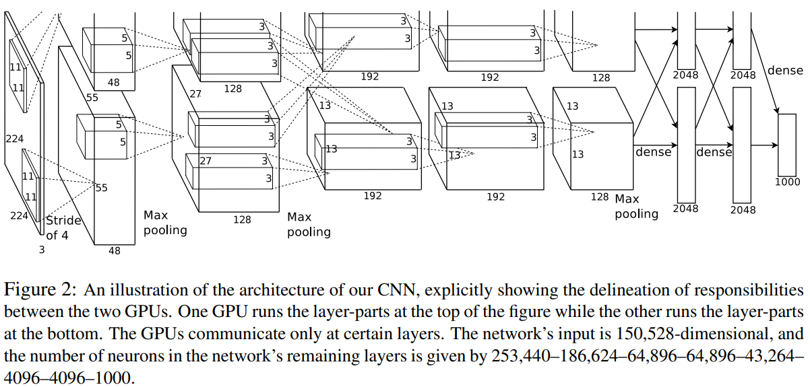
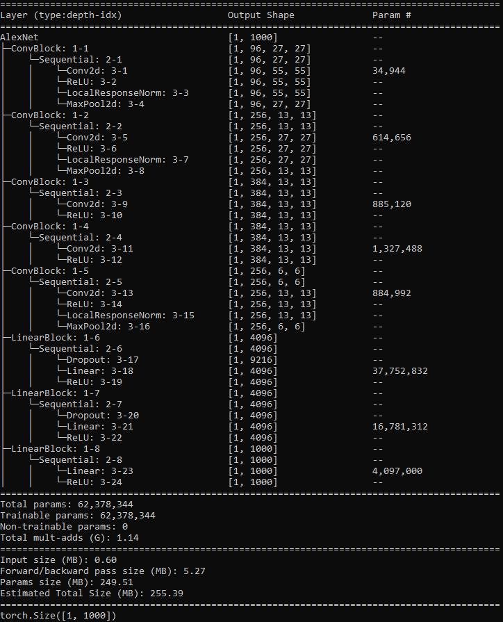

# AlexNet-Implementation

## Architecture



"ImageNet Classification with Deep Convolutional Neural Networks" by Alex Krizhevsky, Ilya Sutskever and Geoffrey Hinton. 

Paper: https://proceedings.neurips.cc/paper_files/paper/2012/file/c399862d3b9d6b76c8436e924a68c45b-Paper.pdf

## GPU POOR !!!

Currently, GPU Poor. So didn't train the model. But the model is as in the paper. Dive in and check.

## Info

For information about the model, following script is helpful.

```sh
python info.py
```



## Usage

Before running the script, place your data directory location for both train and test data in `root_dir="{DIR}"` here at [dataloader.py](./dataloader/dataloader.py)

```sh
python train.py --epochs 90 --in_channels 3 --num_classes 1000
```
